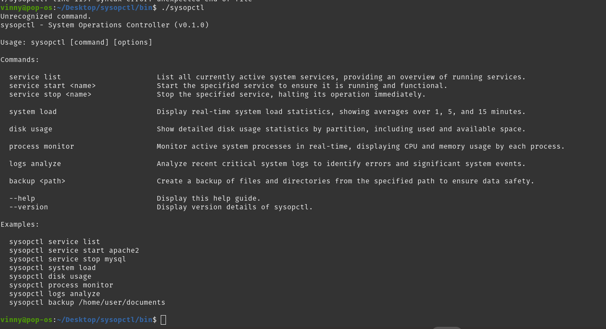
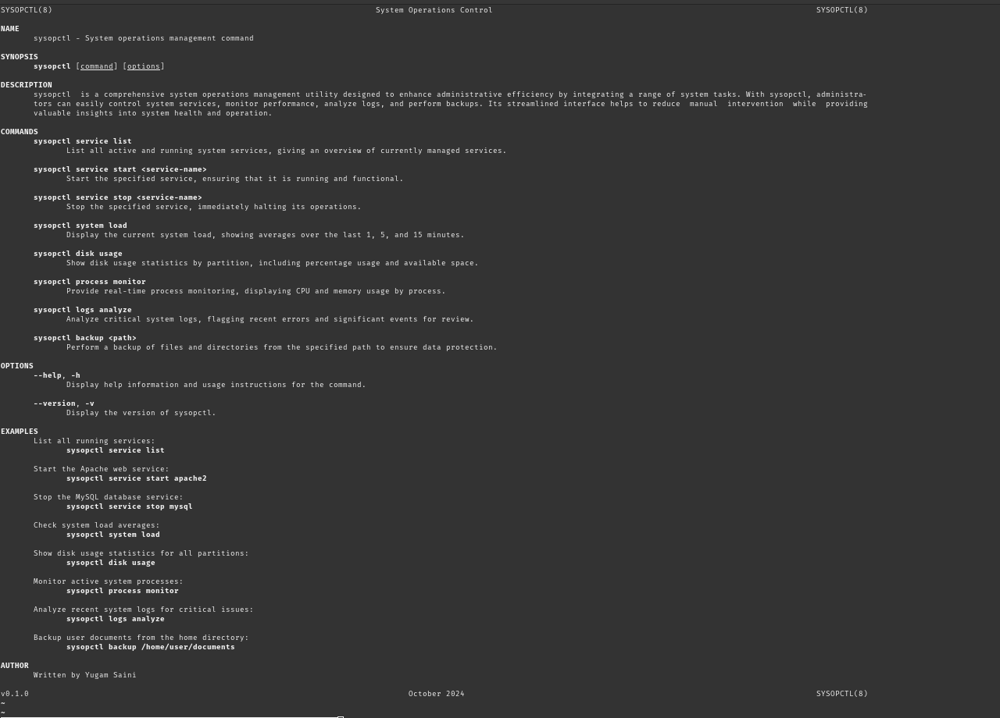
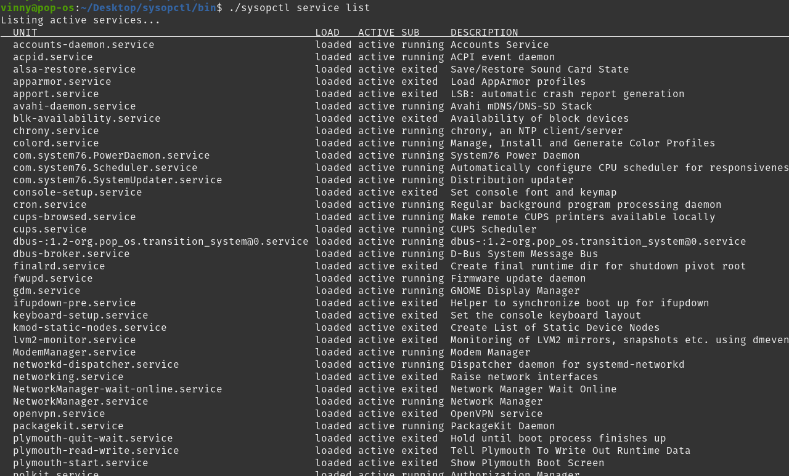
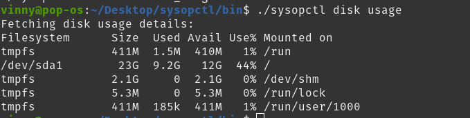
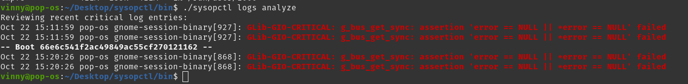
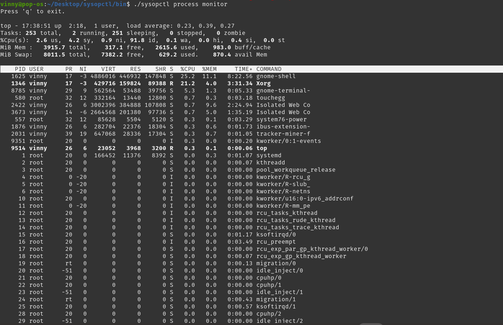

# sysopctl - System Operations Control
**Version:** v0.1.0 

**Author:** Yugam Saini

`sysopctl` is a custom command-line utility designed to enhance system administration capabilities. It simplifies managing system services, processes, and health checks, allowing administrators to control system resources efficiently.
## Overview
`sysopctl` provides a unified interface to manage system services, monitor system health, track processes, analyze logs, and automate backups. It combines essential system management functions into a single command-line tool, increasing efficiency for system administrators.

## Installation
To install `sysopctl`, clone the repository and follow the build instructions:
```bash 
git clone https://github.com/yugamsaini/sysopctl.git
cd sysopctl/bin
```

## Commands
### 1. **Service Management**
- **Command**: `sysopctl service list`  
  **Description**: Displays a list of all currently active system services.  
  **Example**:  
  ```bash
  sysopctl service list
  ```
- **Command**: `sysopctl service start <service-name>`  
  **Description**: Starts the specified service to ensure it is running and available.  
  **Example**:  
  ```bash
  sysopctl service start apache2
  ```

- **Command**: `sysopctl service stop <service-name>`  
  **Description**: Stops the specified service, halting its operation.  
  **Example**:  
  ```bash
  sysopctl service stop apache2
  ```

### 2. **System Health**

- **Command**: `sysopctl system load`  
  **Description**: Displays real-time system load statistics, including load averages over 1, 5, and 15 minutes. Useful for monitoring resource consumption and system performance.  
  **Example**:  
  ```bash
  sysopctl system load
  ```

### 3. **Disk Usage**

- **Command**: `sysopctl disk usage`  
  **Description**: Shows a detailed breakdown of disk usage by partition, helping administrators track storage consumption.  
  **Example**:  
  ```bash
  sysopctl disk usage
  ```

### 4. **Process Monitoring**

- **Command**: `sysopctl process monitor`  
  **Description**: Provides real-time monitoring of system processes, showing statistics like CPU and memory usage per process.  
  **Example**:  
  ```bash
  sysopctl process monitor
  ```

### 5. **Log Analysis**

- **Command**: `sysopctl logs analyze`  
  **Description**: Analyzes critical system logs and highlights recent events that may require attention, helping detect potential system issues.  
  **Example**:  
  ```bash
  sysopctl logs analyze
  ```

### 6. **Backup**

- **Command**: `sysopctl backup <path>`  
  **Description**: Creates a backup of files and directories at the specified path, ensuring important data is safe.  
  **Example**:  
  ```bash
  sysopctl backup /home/user/documents
  ```

### 7. **Help and Version**

- **Command**: `sysopctl --help`  
  **Description**: Displays help information, including all available commands and their usage.  
  **Example**:  
  ```bash
  sysopctl --help
  ```

- **Command**: `sysopctl --version`  
  **Description**: Displays the current version of the `sysopctl` tool.  
  **Example**:  
  ```bash
  sysopctl --version
  ```

## Examples

- To list all running services:
  ```bash
  sysopctl service list
  ```

- To start the Apache service:
  ```bash
  sysopctl service start apache2
  ```

- To check system load averages:
  ```bash
  sysopctl system load
  ```

- To monitor system processes in real-time:
  ```bash
  sysopctl process monitor
  ```

- To backup user documents:
  ```bash
  sysopctl backup /home/user/documents
  ```

## Screenshots

Here are some screenshots demonstrating the usage of `sysopctl`:








